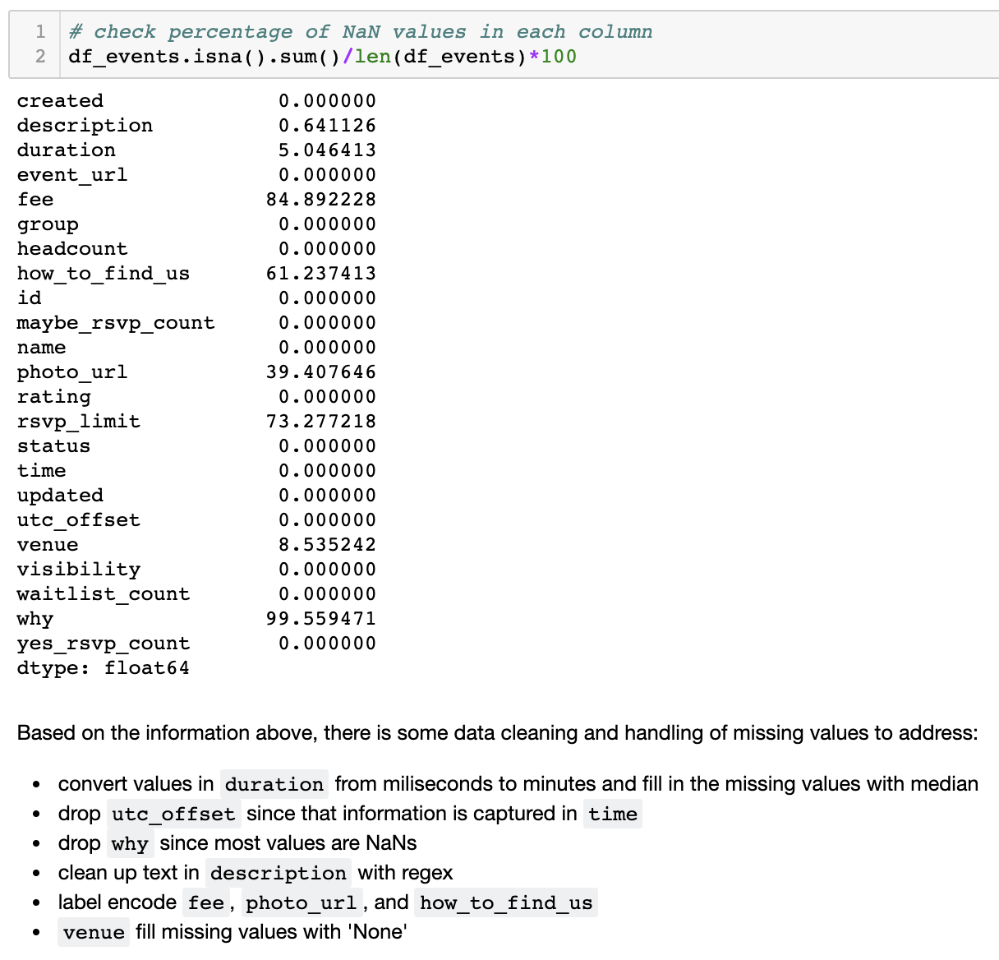

***
# Event RSVP Predictor

<i>Flatiron School Data Science Immersive Program</i> 
<i>Project Date: May 2019 </i>

Predicting yes-RSVP counts for NYC-based events using data sourced from meetup's API.

***

## Motivation
One of the biggest logistical challenges of event planning is in getting a realistic headcount estimation. Almost all of the logistical details of event planning are contingent on how many attendees are expected - most importantly, choosing on an appropriately-sized venue space.  With the trove of past meetup event data, I thought that there might be a way to predict headcount for an event based on features of the event as well as the group hosting the event.

I started off with regression models and then tried a different approach by framing this into a classification question by creating headcount bins. Because there was a lot of rich information in the event descriptions, I conducted NLP analysis via topic modeling to find latent topics within the events themselves, across all categories. I replaced the group_category feature (tech, socializing, etc.) with the event topic since the group_category did not score highly on the feature importance graph derived from the xbgoost model.

## Data Cleaning
For the events data, there were null values to address and data to preprocess.

{ width=50% }

## Data Exploration

## Modeling

## NLP - Topic Modeling

## Takeaways
