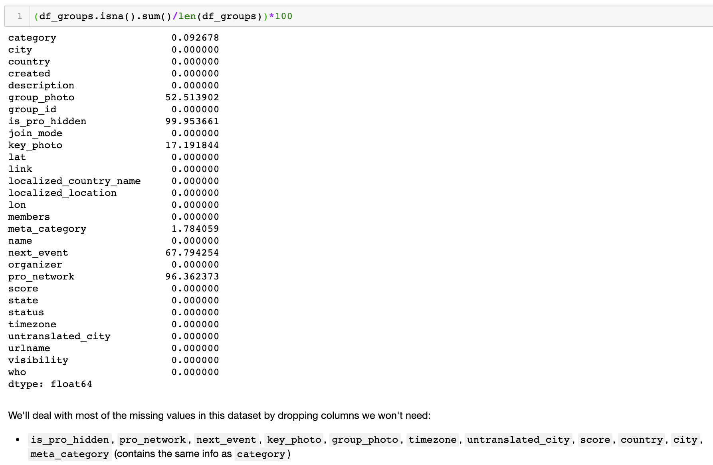

***
# Event RSVP Predictor

Predicting yes-RSVP counts for NYC-based events using data sourced from Meetup's API.

## Motivation

[Meetup's](https://www.meetup.com/) is one of first and most popular event-based social networking sites. With humble beginnings in New York City, the Meetup community now stretches all around the world. The founders of Meetup realized the importance of building real communities through in-person interactions in the form of community events.

One of the biggest challenges of event planning is getting a realistic headcount estimation. Almost all of the logistical details of event planning are contingent on how many attendees are expected - most importantly, choosing on an appropriately-sized venue space.  With the trove of past meetup event data, I thought that there might be a way to predict headcount for an event based on features of the event as well as the group hosting the event.

Additionally, because there was a lot of rich information in the event descriptions, I conducted NLP analysis via topic modeling to find latent topics within the events themselves, across all categories. I replaced the group_category feature (tech, socializing, etc.) with the event topic since the ```group_category``` did not score highly on the feature importance graph derived from the first iteration of the xbgoost model that included ```group_category``` as a feature.

## Data Cleaning
There were null values to address in the events and groups dataset. Based on the percentage of null values for a given feature, the feature column was either dropped or filled with an imputed value.

<p align="center">
 
</p>

<p align="center">
 
</p>


## Data Exploration

#### Events

As expected, most events were located in the greater New York City area but interestingly, events were also organized across the country and abroad.

[insert local and global map images side by side]

The number of events held by each group varied across the category of the hosting group. For example, groups within the 'book club' category held much fewer events than groups within the 'singles' category. This intuitively makes sense - book clubs generally need to space out meetings to ensure members have enough time to read sections of a book whereas the singles group need to provide as many 'mingling' opportunities as possible.


#### Groups


## Modeling

I performed a number of different regression models on the dataset. Below are the results of the regression model using ```group_category``` followed by a second iteration that replaces the category with ```event_topic```. [note differences in performance]


## NLP: Topic Modeling of Event Descriptions


## Takeaways & Next Steps

One of the biggest caveats for this model is that 'yes' RSVP count inherently is not an accurate reflection of actual event attendance. However, until accurate and comprehensive attendance data is available, the yes-RSVP count can serve as a suitable proxy. When and if actual attendance data is available, the same preprocessing and modeling steps can be taken as outlined here to obtain predictions using real attendance data.

For next steps, I plan to gather event data for the rest of 2018 to improve model performance, namely to address the uneven distribution of lower-RSVP-count vs. higher-RSVP-count events. Additionally, I would like to frame this question as a classification problem to provide a range prediction instead of a single-value prediction which may be difficult for event organizers to interpret. Providing a lower and upper headcount will likely be much easier for event organizers to work with.


- reg w/ all data
- class w/ all data (measure performance w/ ROC-AUC graphs, confusion matrices & precision/recall/F1)
    - SMOTE (post train/test/split to avoid data leakage)
    - under-sample majority class
    - note that you do not have to have a perfect 1:1 ratio across all classes - try any ratio that is better than what you currently have
- visualize centroids of member-clusters?
