***
# Event RSVP Predictor

Predicting yes-RSVP counts for NYC-based events using data sourced from Meetup's API.


## Motivation

[Meetup](https://www.meetup.com/) is one of first and most popular event-based social networking sites. With humble beginnings in New York City, the Meetup community now stretches all around the world. The founders of Meetup realized the importance of building real communities through in-person interactions in the form of community events.

One of the biggest challenges of event planning is getting a realistic headcount estimation. Almost all of the logistical details of event planning are contingent on how many attendees are expected - most importantly, choosing on an appropriately-sized venue space.  With the trove of past meetup event data, I thought that there might be a way to predict headcount for an event based on features of the event as well as the group hosting the event.

Additionally, because there was a lot of rich information in the event descriptions, I conducted NLP analysis via topic modeling to find latent topics within the event descriptions across all categories.

## Data Cleaning

First iteration of dataset included contained 8,624 NYC-based groups and 25,424 events (covering September-October 2018).

Before conducting initial analyses, I reviewed the raw data to address missing values by removing a column altogether or filling with a value.

<p align="center">
 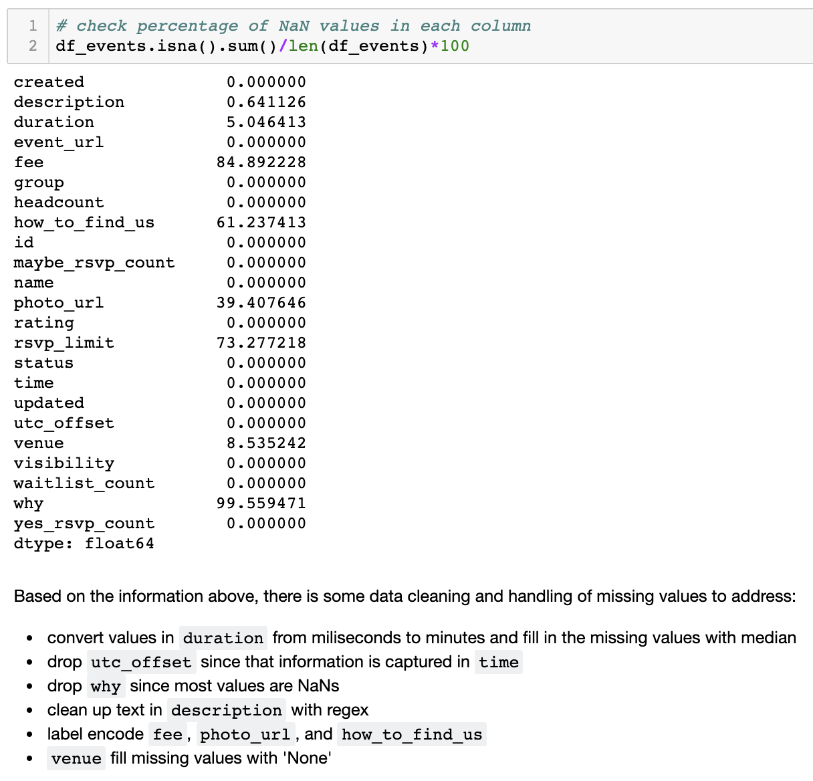
</p>

<p align="center">
 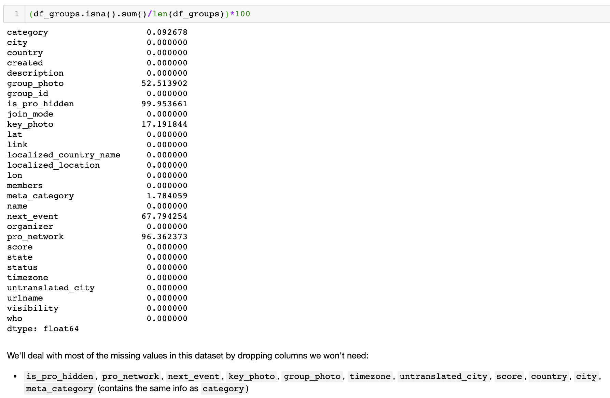
</p>


## Data Exploration

#### Events

As expected, most events were located in the greater New York City area but interestingly, events were also organized across the country and abroad. (Note the events shown in the maps below are from a sample of just 2,000 events.)

<p align='center'>
 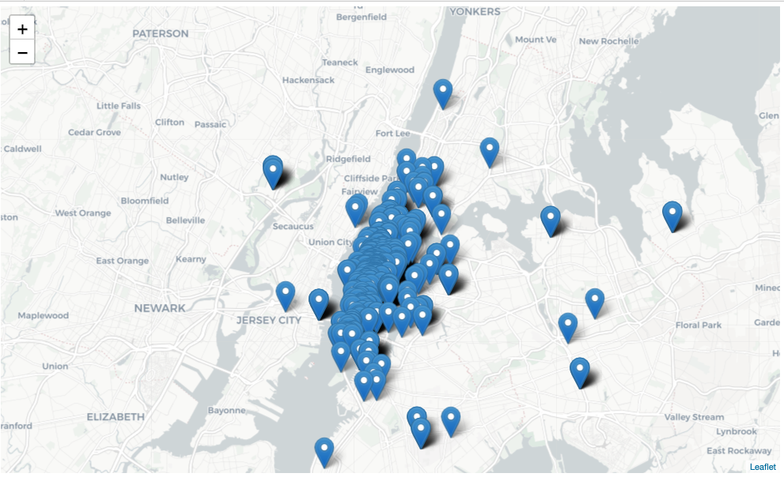

 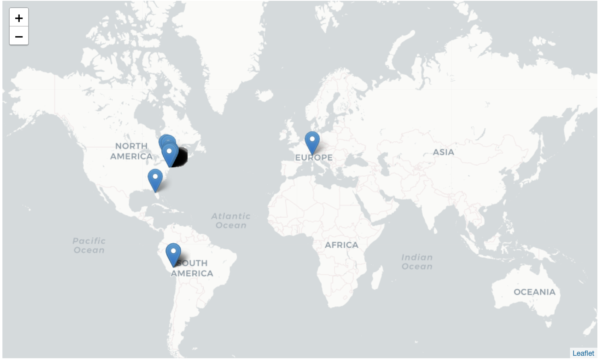
</p>

The number of events held by each group varied across the category of the hosting group. For example, book-club groups held much fewer events than singles groups. This intuitively makes sense - book clubs generally need to space out meetings to ensure members have enough time to read sections of a book whereas the singles group look to provide as many 'mingling' opportunities as possible.

<p align='center'>
 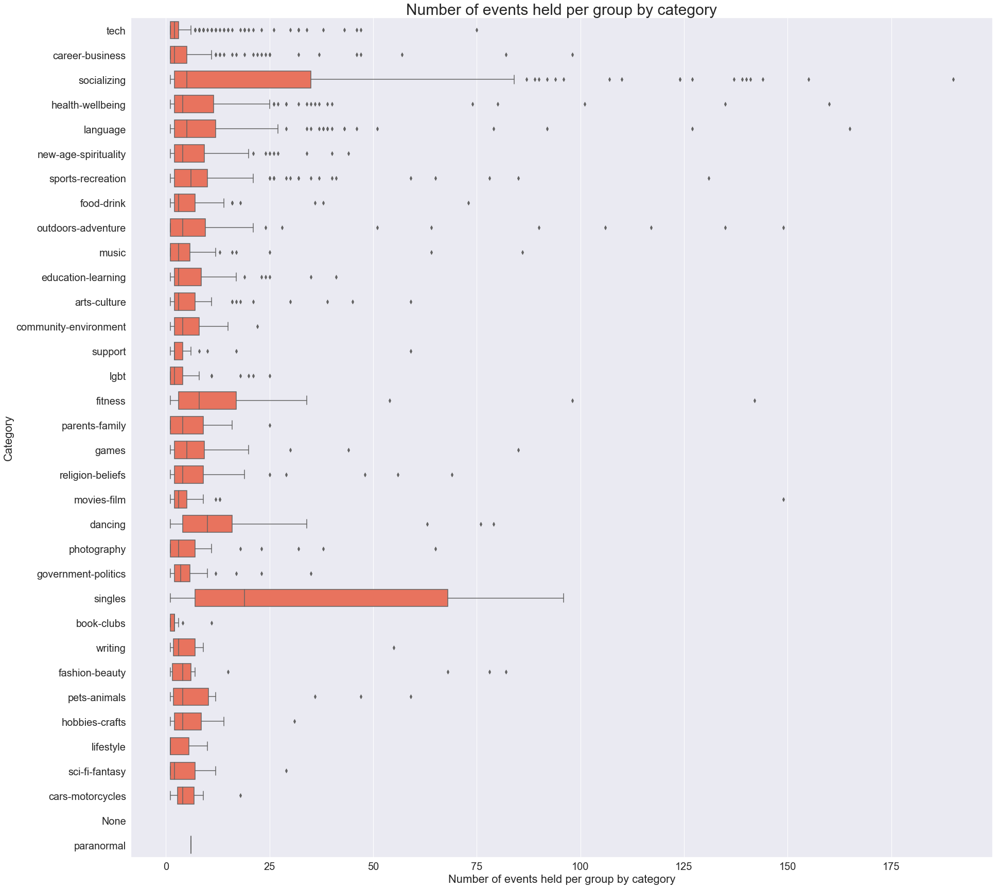
</p>

There is a clear pattern in the total number of events held per day. The number of events usually peak on Saturdays and dip on Mondays.

<p align='center'>
 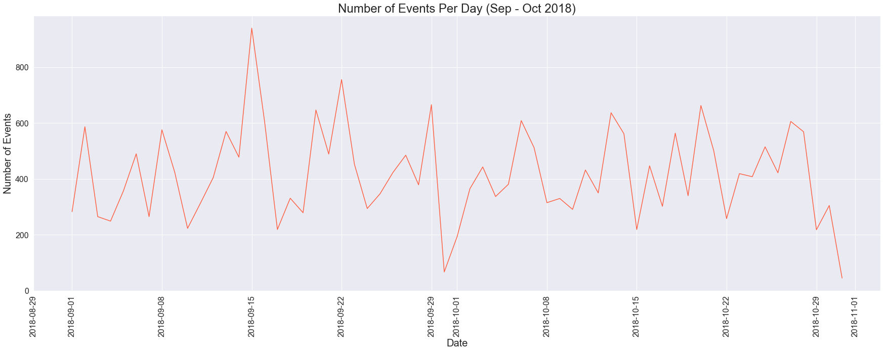
</p>


#### Target

The yes-RSVP count for events ranged from 0 to 592 with an average of 13 and a median of 4. There were a small number of outliers -  283 events with 0 yes-RSVPs and 351 events with yes-RSVPs > 100. Because the total number of outliers in the dataset amounted to just a small portion, I retained those values since they would likely have a negligible effect on model performance.

<p align='center'>
 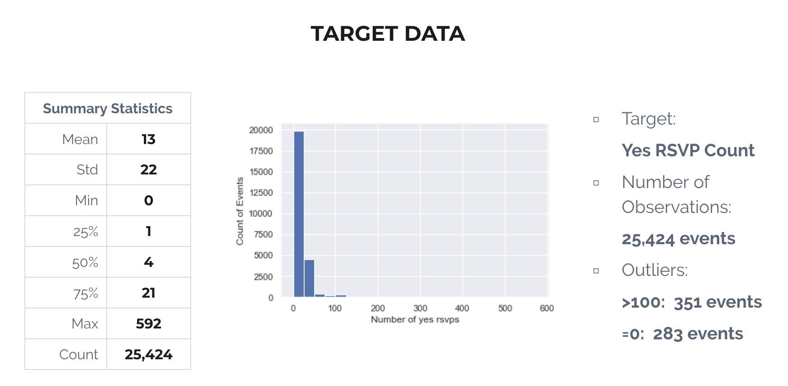
</p>

#### Groups

There are X different categories of groups on Meetup. The tech and business-networking categories have the most number of groups. The numbers quickly drop off for all other categories. This could be unique to NYC as a central economic and tech hub.

<p align='center'>
 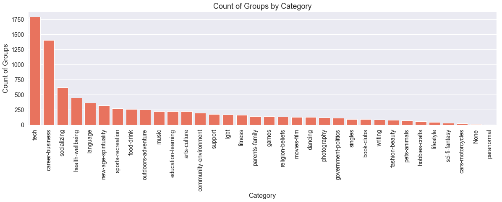
</p>

The membership count for each group by category is shown in the boxplot below.

<p align='center'>
 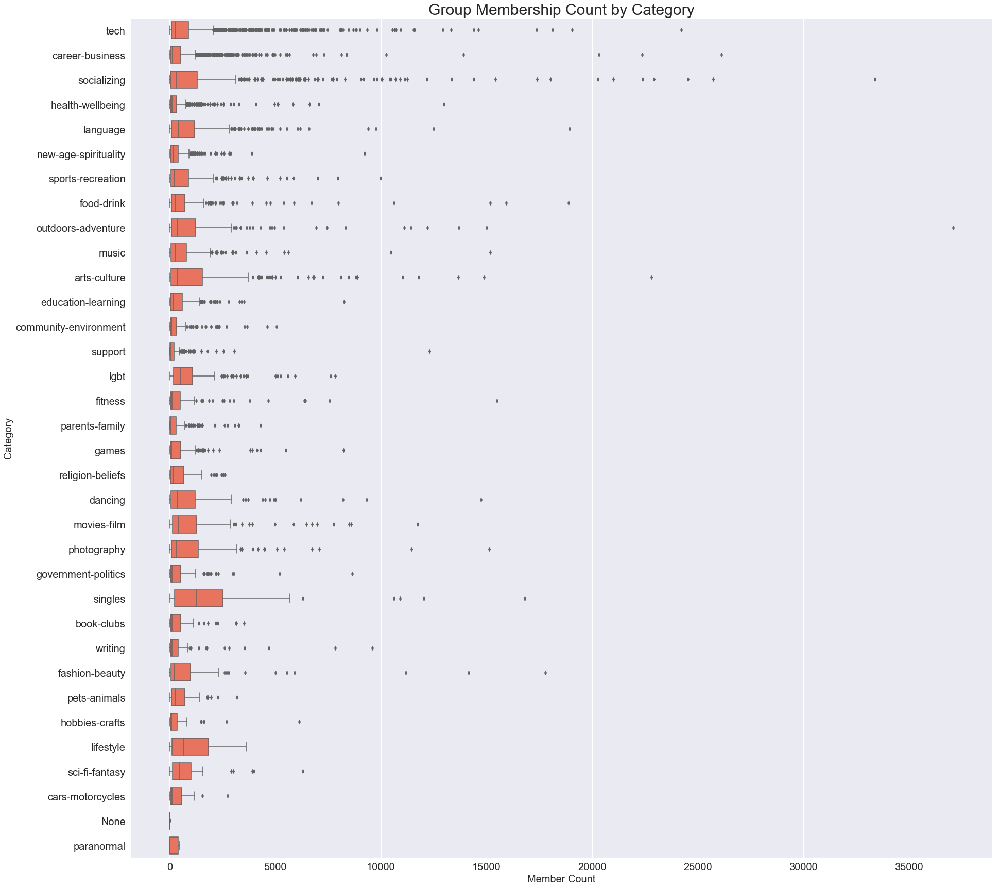
</p>

## Modeling

Below is a summary of all the regression models I ran. We'll take a closer look at the baseline and the best performing models below.

<p align='center'>
 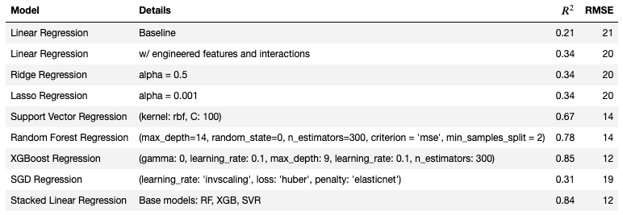
</p>

#### Baseline

The baseline model was a multivariate linear regression containing the following features:

- number of members in the event's group
- number of total events held by the group
- event duration
- group category

The resulting model had an R<sup>2</sup> = .21 and RMSE = 21. Below is a distribution plot of the residual values. Clearly, there was room for improvement.

<p align='center'>
 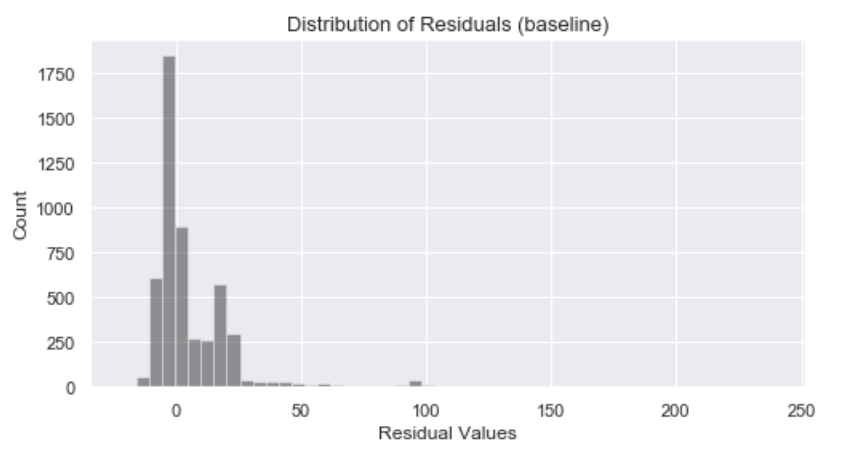
</p>

#### Best Model

The best performing model was an xgboost regression that contained 46 features in total:
- baseline features above
- engineered features:
    - number of days between event posting and event date
    - num_words
    - day of week of the event
    - number of years the group has been around
    - number of subway stations within 0.5 miles from event venue
    - time of day of the event
- additional (binary) features:
    - whether there was more information on how to find the event
    - whether there was an RSVP limit
    - whether there was a photo posted to the event
    - whether the group is open
    - whether there was an event fee

The resulting model had an R<sup>2</sup> = 0.85 and a RMSE = 12. Below is a distribution plot of the residual values. There is a clear improvement in that residuals values have moved closer to the 0 bin.

<p align='center'>
 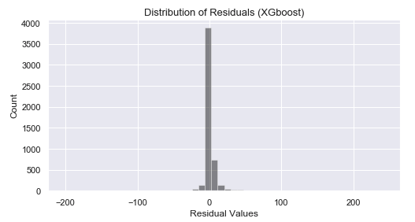
</p>


#### Feature Importance

From the xgboost model, we were able to obtain a graph of the feature importance. This is helpful to know for additional feature selection and potential dimensionality reduction by removing features that have little to no effect on the prediction.

The top three most important features were:
- number of days between event posting and event date
- number of words in the event description
- number of members in the group

<p align='center'>
 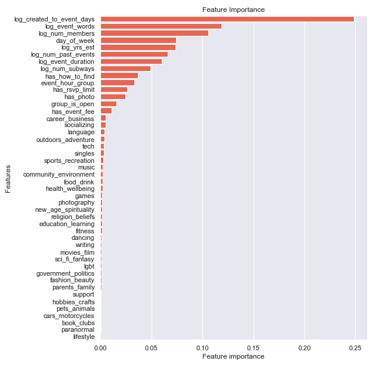
</p>

Surprisingly, the ```group_category``` did not play much of a role in the yes-RSVP count and could be removed from the model with little change in performance.


## (NLP) Topic Modeling of Event Descriptions

To analyze the latent topics in the event descriptions, I used the Latent Dirichlet Allocation (LDA) Model to classify text in the event description to a particular topic and derived 8 unique topics. As shown by the graph below, the topics were decently well-separated indicating little overlap in topics.

<p align='center'>
 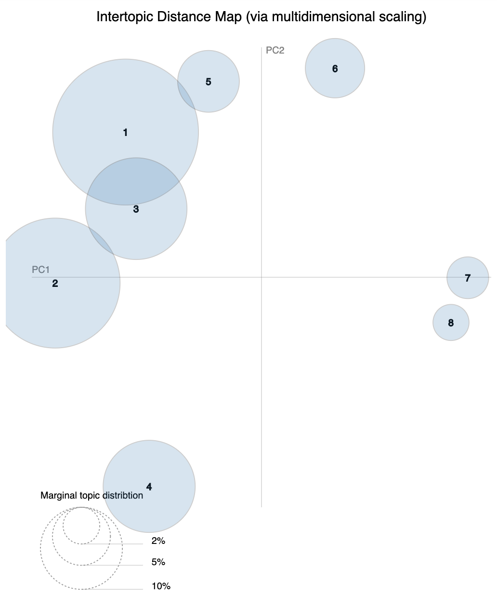
</p>

<p align='center'>
 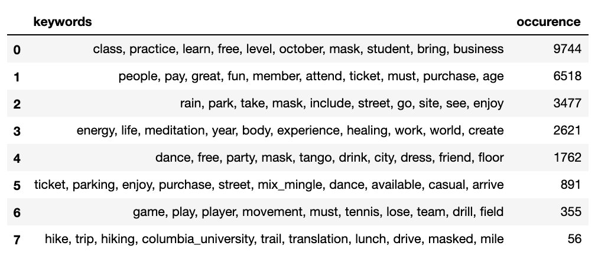
</p>


## Takeaways

One of the biggest caveats for this model is that yes-RSVP count is not an accurate reflection of event attendance. However, until actual attendance data is available, the yes-RSVP count can serve as a suitable proxy. When and if attendance data is available, the same preprocessing and modeling steps can be taken as outlined here to obtain attendance predictions.

Based on the feature importance graph, there are some factors that are directly in an organizer's control that influences the yes-RSVP count, such as number of days between posting an event and word count of the event description, and day of week of the event, if an organizer is looking to maximize their yes-RSVP count for an event.

Group category has little to do with yes-RSVP count but there might be some influence with topic model.

<b>Try it out yourself!</b>

To test out the model's prediction, go to the RSVP Event Predictor notebook. You will first need to get a NYC-based Meetup event URL and pass in the last digits/letters of the link into the prediction function. The function will then return the event name, group name, predicted yes-RSVP count, and actual yes-RSVP count. (See example below.)

<p align='center'>
 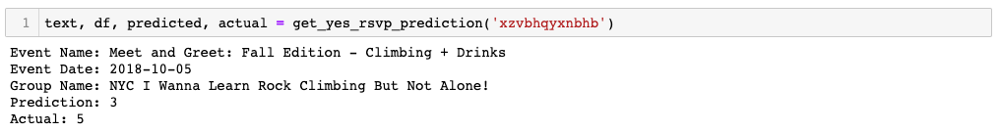
</p>


## Next Steps

For next steps, I plan to gather event data for the rest of 2018 to improve model performance. Additionally, I would like to frame this question as a classification problem to provide a range prediction instead of a single-value prediction. Providing a lower and upper headcount will likely be much easier for event organizers to work with.

As part of my data gathering step, I scraped members' groups and interests from their Meetup profile and would like to run some NLP analysis on that to cluster members for potential segmentation application.
