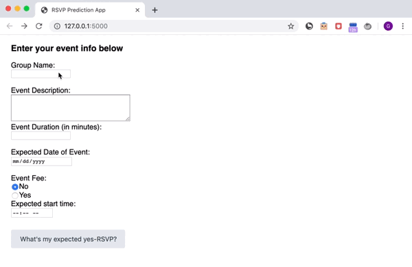

***
# Event RSVP Predictor

Predicting yes-RSVP counts for NYC-based events using data sourced from Meetup's API.

<u>Tools:</u>
- Data Analysis:
    - Pandas
    - Numpy
    - Matplotlib / Seaborn
    - Folium
- Modeling:
    - Scikit-learn (regression, classification, clustering)
- NLP:
    - NLTK
    - Regex


## Motivation

[Meetup](https://www.meetup.com/) is a popular event-based social networking sites that aims to connect people to their local communities in-person through  events that cater to their interests.

One of the biggest challenges of event planning is getting a realistic headcount estimation.  With the trove of past meetup event data, I thought that there might be a way to predict headcount for an event based on features of the event as well as the group hosting the event. I did this through both regression and classification models.

Additionally, because there was a lot of rich text information in event descriptions as well as member profiles, I used natural language processing (NLP) to conduct topic modeling on events and k-means clustering of members.


## Data Cleaning

First iteration of dataset included contained 8,624 NYC-based groups and 25,424 events (covering September-October 2018).

Before conducting initial analyses, I reviewed the raw data to address missing values by removing a column altogether or filling with a value.

<p align="center">
 
</p>

<p align="center">
 
</p>


## Data Exploration

#### Events

As expected, most events were located in the greater New York City area but interestingly, events were also organized across the country and abroad. (Note the events shown in the maps below are from a sample of just 2,000 events.)

<p align='center'>
 

 
</p>

The number of events held by each group varied across the category of the hosting group. For example, book-club groups held much fewer events than singles groups. This intuitively makes sense - book clubs generally need to space out meetings to ensure members have enough time to read sections of a book whereas the singles group look to provide as many 'mingling' opportunities as possible.

<p align='center'>
 
</p>

There is a clear pattern in the total number of events held per day. The number of events usually peak on Saturdays and dip on Mondays.

<p align='center'>
 
</p>


#### Target

The yes-RSVP count for events ranged from 0 to 592 with an average of 13 and a median of 4. There were a small number of outliers -  283 events with 0 yes-RSVPs and 351 events with yes-RSVPs > 100. Because the total number of outliers in the dataset amounted to just a small portion, I retained those values since they would likely have a negligible effect on model performance.

<p align='center'>
 
</p>

#### Groups

There are 33 different categories of groups on Meetup. The tech and business-networking categories have the most number of groups. The numbers quickly drop off for all other categories. This could be unique to NYC as a central economic and tech hub.

<p align='center'>
 
</p>

The membership count for each group by category is shown in the boxplot below.

<p align='center'>
 
</p>

## Regression Models

Below is a summary of all the regression models I ran. The assumptions required for a linear regression model did not hold so I ran non-parametric regression models instead.

<p align='center'>
 
</p>

#### Best Model

The best performing model was an xgboost regression that contained 46 features in total:
- baseline features (number of members in the event's group, number of total events held by the group, event duration, group category)
- engineered features:
    - number of days between event posting and event date
    - num_words
    - day of week of the event
    - number of years the group has been around
    - number of subway stations within 0.5 miles from event venue
    - time of day of the event
- additional (binary) features:
    - whether there was more information on how to find the event
    - whether there was an RSVP limit
    - whether there was a photo posted to the event
    - whether the group is open
    - whether there was an event fee

The resulting model had an R<sup>2</sup> = 0.85 and a RMSE = 12. Below is a distribution plot of the residual values. There is a clear improvement in that residuals values have moved closer to the 0 bin.

<p align='center'>
 
</p>


#### Feature Importance

From the xgboost model, we were able to obtain a graph of the feature importance. This is helpful to know for additional feature selection and potential dimensionality reduction by removing features that have little to no effect on the prediction.

The top three most important features were:
- number of days between event posting and event date
- number of words in the event description
- number of members in the group

<p align='center'>
 
</p>

Surprisingly, the ```group_category``` did not play much of a role in the yes-RSVP count and could be removed from the model with little change in performance.

## Classification Models

Link to Medium posts covering the classification models I built:

- https://medium.com/@grace01/predicting-meetup-event-size-using-a-classification-model-77d782202e9b

- https://medium.com/@grace01/part-2-predicting-meetup-event-size-using-a-classification-model-76d597e3f52f

## (NLP) Topic Modeling of Event Descriptions

To analyze the latent topics in the event descriptions, I used the Latent Dirichlet Allocation (LDA) Model to classify text in the event description to a particular topic and derived 8 unique topics. As shown by the graph below, the topics were decently well-separated indicating little overlap in topics.

<p align='center'>
 
</p>

<p align='center'>
 
</p>

## Member Clustering

I ran a K-Means clustering algorithm on a TF-IDF vectorized matrix with 250 features of ~33K member profiles. After running an elbow plot, the optimal cluster size seem to be around 50.


With cluster size determined, I pulled the top keywords for each cluster and mapped each member to the appropriate cluster group. With this information, we can now find segments of members based on their interests and group activity by running a search within cluster keywords.

<p align='center'>
 
</p>

<p align='center'>
 
</p>


## Model Deployment with Flask

Using Flask, I built out a web app to demonstrate how the yes-rsvp-prediction classification model could be used to help event organizers during the event creation stage on Meetup.




## Takeaways

One of the biggest caveats for this model is that yes-RSVP count is not an accurate reflection of event attendance. However, until actual attendance data is available, the yes-RSVP count can serve as a suitable proxy. When and if attendance data becomes available, the same preprocessing and modeling steps can be taken as outlined here to obtain attendance predictions.
